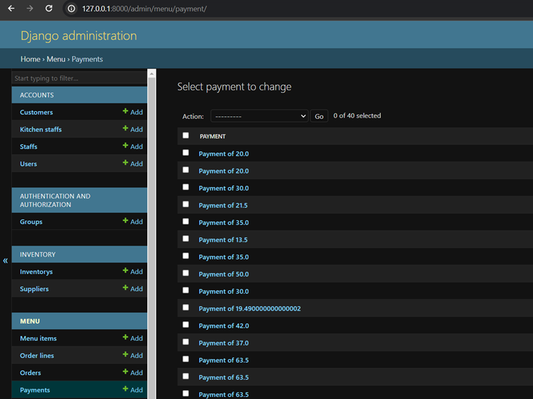
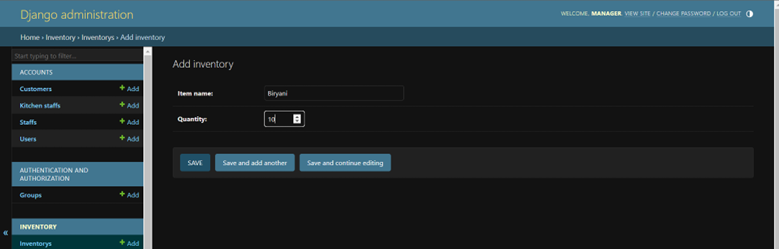

# 🍽️ Relaxing Koala – Restaurant Information System

 
 
 
 

Relaxing Koala is a **Restaurant Information System** designed to streamline operations for a restaurant expanding from **50 to 150 customers**.  
It replaces manual workflows with an **automated web-based solution** for:  

- Order management  
- Table reservations  
- Payment processing  
- Inventory tracking  
- Admin oversight  

Developed as part of **SWE30003 – Software Architectures and Design (Assignment 3)**.

---

## ✨ Features

- 👤 **Authentication:** Register and login for both customers and staff.  
- 🍔 **Menu & Ordering:** Customers can browse the menu, select items, and place orders.  
- 💳 **Payments:** Integrated checkout system with validation.  
- 📅 **Reservations:** Customers can reserve tables online.  
- 📦 **Inventory Management:** Admin can add/update menu items and manage stock.  
- 🛠 **Admin Dashboard:** Oversee orders, reservations, payments, suppliers, and inventory.  
- 📝 **Feedback System:** Capture customer feedback (part of extended design).  

---

## 📸 Screenshots

### 🏠 Home Page
  
*Landing page with quick access to menu, reservations, and account management.*

---

### 🔑 Authentication
| Login | Register |
|-------|----------|
|  |  |

---

### 🍽️ Ordering & Checkout
| Order Menu | Checkout |
|------------|----------|
|  |  |

---

### 📦 Orders & Reservations
| Order Details | Reservation Confirmation |
|---------------|--------------------------|
|  |  |

---

### 🛠️ Admin Panel
| Payments | Inventory | Reservations |
|----------|-----------|--------------|
|  |  |  |

---

### 📦 Supplier & Inventory Management
| Supplier Management | Add Inventory | Add Menu Item |
|---------------------|---------------|---------------|
|  |  |  |

---

## 🛠 Tech Stack

**Backend:** Django (Python)  
**Frontend:** HTML, CSS, Bootstrap  
**Database:** SQLite  
**Architecture:** MVC with OOP design patterns  

---

## ⚙️ Installation & Setup

### 🔧 Prerequisites
- Python 3.x  
- Django (install via pip)  

### Clone the repo:  
   ```bash
   git clone <repo-url>
   cd relaxing-koala
